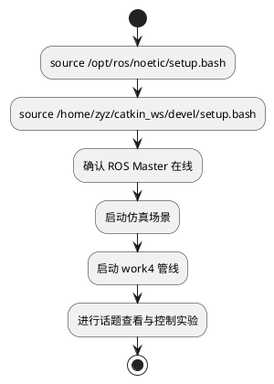
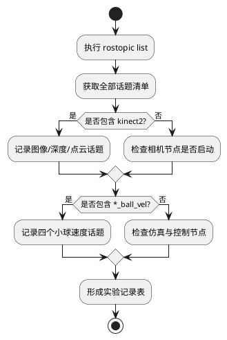
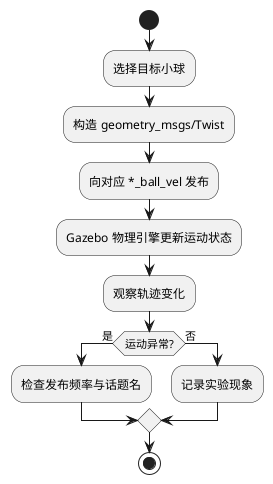
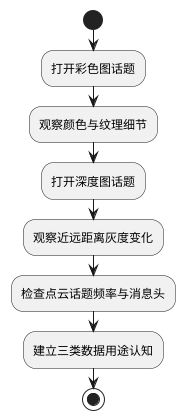
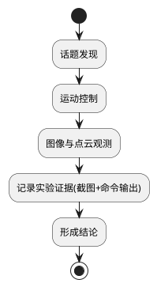

# L3机器人足球场仿真环境配置

## 1. 实验目标

本节围绕机器人足球场仿真中的视觉与话题通信，完成以下三项核心能力：

1. 使用 rostopic list 查看所有话题，记录 Kinect2 图像话题与小球速度话题。
2. 能够分别控制 red_ball、green_ball、blue_ball、orange_ball 运动。
3. 使用 image_view 查看实时相机画面，观察彩色图、深度图、点云话题，并了解各自用途。

---

## 2. 实验环境与准备

- 系统：Ubuntu 20.04 + ROS Noetic
- 工作空间：/home/zyz/catkin_ws
- 主要包：wpr_simulation、work4
- 可视化工具：image_view、rostopic

建议先完成以下启动流程，再进行实验记录。



截图占位：


(截图说明：终端中完成环境 source 与启动流程的界面)

### 2.1 一条命令直达可截图状态（推荐）

在 WSL 终端执行下面这一条命令：

```bash
bash /home/zyz/learning_opencv/Work4/doc/run_capture_ready.sh
```

执行后会自动完成：

1. 清理旧进程冲突。
2. 启动 roscore、仿真场景、work4 管线。
3. 打开 image_view 实时画面。
4. 生成终端证据文件 `/tmp/work4_capture/report_terminal_output.txt`。

你只需要按脚本末尾提示截图并粘贴到本文对应占位处即可。

---

## 3. 使用 rostopic list 识别关键话题

### 3.1 操作步骤

在终端执行：

```bash
source /opt/ros/noetic/setup.bash
rostopic list
```

得到全量话题后，重点筛选两类：

1. Kinect2 图像相关话题。
2. 小球速度控制相关话题。



### 3.2 关键话题记录（示例）

| 类别 | 话题名 | 典型消息类型 | 用途 |
|---|---|---|---|
| 彩色图像 | /kinect2/sd/image_color_rect | sensor_msgs/Image | 目标识别、可视化显示 |
| 深度图像 | /kinect2/sd/image_depth_rect | sensor_msgs/Image | 目标距离估计、三维结构感知 |
| 点云数据 | /kinect2/sd/points | sensor_msgs/PointCloud2 | 三维重建、障碍感知 |
| 红球速度 | red_ball_vel | geometry_msgs/Twist | 控制 red_ball 运动 |
| 绿球速度 | green_ball_vel | geometry_msgs/Twist | 控制 green_ball 运动 |
| 蓝球速度 | blue_ball_vel | geometry_msgs/Twist | 控制 blue_ball 运动 |
| 橙球速度 | orange_ball_vel | geometry_msgs/Twist | 控制 orange_ball 运动 |

说明：话题名可能因场景或 launch 文件版本不同略有差异，最终以 rostopic list 实际结果为准。

截图占位：


(截图说明：rostopic list 全部输出，包含 Kinect2 与四个 ball_vel 话题)

---

## 4. 分别控制四个小球运动

### 4.1 控制逻辑说明

四个小球分别通过独立速度话题接收 Twist 消息，从而实现互不干扰的独立运动控制。



### 4.2 典型控制命令（可分别执行）

```bash
# red_ball
rostopic pub -r 10 /red_ball_vel geometry_msgs/Twist "{linear: {x: 0.4, y: 0.0, z: 0.0}, angular: {x: 0.0, y: 0.0, z: 0.2}}"

# green_ball
rostopic pub -r 10 /green_ball_vel geometry_msgs/Twist "{linear: {x: 0.2, y: 0.0, z: 0.0}, angular: {x: 0.0, y: 0.0, z: -0.3}}"

# blue_ball
rostopic pub -r 10 /blue_ball_vel geometry_msgs/Twist "{linear: {x: 0.3, y: 0.0, z: 0.0}, angular: {x: 0.0, y: 0.0, z: 0.0}}"

# orange_ball
rostopic pub -r 10 /orange_ball_vel geometry_msgs/Twist "{linear: {x: 0.1, y: 0.0, z: 0.0}, angular: {x: 0.0, y: 0.0, z: 0.5}}"
```

如果你的环境中速度话题无前导斜杠，可去掉命令中的 /，以本机 rostopic list 结果为准。

截图占位：


(截图说明：分别发布四个球速度命令的终端画面)


(截图说明：Gazebo 中四个球产生不同运动轨迹的画面)

---

## 5. 使用 image_view 观察实时相机画面

### 5.1 彩色图像查看

```bash
rosrun image_view image_view image:=/kinect2/sd/image_color_rect
```

### 5.2 深度图像查看

```bash
rosrun image_view image_view image:=/kinect2/sd/image_depth_rect
```

### 5.3 点云话题检查与用途理解

点云通常使用 PointCloud2，不能直接用 image_view 观看像素图。建议先确认其数据流正常：

```bash
rostopic hz /kinect2/sd/points
rostopic echo -n 1 /kinect2/sd/points
```



### 5.4 三类数据用途总结

1. 彩色图（RGB）：用于颜色识别、目标检测、可视化展示。
2. 深度图（Depth）：用于估计目标与相机距离，辅助追踪与避障。
3. 点云（PointCloud2）：用于三维空间理解、物体表面几何分析、建图与定位。

截图占位：


(截图说明：image_view 显示彩色图)


(截图说明：image_view 显示深度图)


(截图说明：rostopic hz 与 rostopic echo 验证点云话题)

---

## 6. 实验结果与结论

### 6.1 结果检查清单

- 已通过 rostopic list 获取并记录 Kinect2 图像话题与四个小球速度话题。
- 已通过四个 *_ball_vel 话题分别控制 red_ball、green_ball、blue_ball、orange_ball 运动。
- 已使用 image_view 观察实时彩色图与深度图，并通过 rostopic 工具确认点云话题正常发布。

### 6.2 结论

本实验完成了机器人足球场仿真环境中的视觉话题识别、四球独立运动控制和多模态相机数据观察。通过对彩色图、深度图、点云的联合理解，可为后续目标检测、追踪控制与三维感知提供稳定的数据基础。



截图占位：


(截图说明：最终实验总览，含仿真场景与关键终端)
