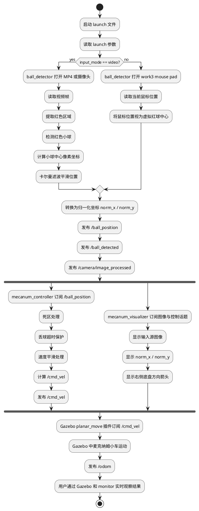
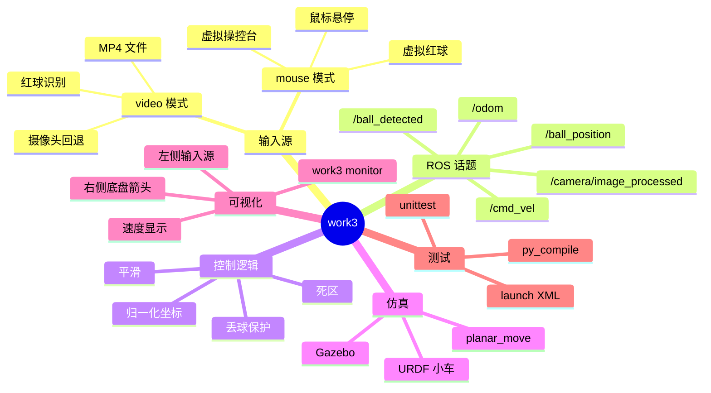

# work3 项目全流程文档

## 1. 项目简介

`work3` 是一个基于 `OpenCV + ROS + Gazebo` 的虚拟摇杆控制项目。

项目核心思路是：

1. 先生成一个“红色小球输入源”
2. 再把红球在画面中的位置转换成标准化坐标
3. 控制器读取标准化坐标并计算 `/cmd_vel`
4. Gazebo 中的小车根据 `/cmd_vel` 运动
5. 监视窗口实时展示输入、控制和运动方向

当前项目支持两种输入模式：

- `video`：读取 MP4 或摄像头画面，识别真实红色小球
- `mouse`：打开鼠标操控台，鼠标位置就是虚拟红球位置

---

## 2. 项目目录结构

```text
work3/
├── CMakeLists.txt
├── README.md
├── PROJECT_FLOW.md
├── package.xml
├── requirements.txt
├── test_video.mp4
├── config/
│   ├── control_params.yaml
│   ├── hsv_red_range.yaml
│   ├── mecanum_controllers.yaml
│   └── scene_layout.yaml
├── launch/
│   ├── ball_control.launch
│   └── mecanum_sim.launch
├── rviz/
│   └── mecanum_robot.rviz
├── scripts/
│   ├── create_test_video.py
│   ├── test_cmd_vel.sh
│   └── test_mecanum.py
├── src/
│   ├── ball_detector.py
│   ├── mecanum_controller.py
│   ├── mecanum_driver.py
│   ├── mecanum_logic.py
│   └── mecanum_visualizer.py
├── tests/
│   └── test_mecanum_logic.py
└── urdf/
    └── mecanum_robot_ridgeback.urdf
```

---

## 3. 核心模块职责

### 3.1 `ball_detector.py`

统一输入源节点，负责产生红球位置。

职责：

- `video` 模式下读取 MP4/摄像头
- `mouse` 模式下生成虚拟操控台画布
- 统一发布：
  - `/ball_position`
  - `/ball_detected`
  - `/camera/image_processed`

### 3.2 `mecanum_controller.py`

控制器节点，负责将球的位置转换成机器人速度。

职责：

- 订阅 `/ball_position`
- 订阅 `/ball_detected`
- 结合死区、丢球超时、平滑参数计算 `/cmd_vel`

### 3.3 `mecanum_visualizer.py`

监视节点，负责展示整个控制过程。

职责：

- 显示输入源图像
- 显示标准化坐标
- 显示 `/cmd_vel`
- 显示右侧底盘与方向箭头

### 3.4 `mecanum_logic.py`

纯逻辑函数模块。

职责：

- 死区处理
- 小球位置到速度映射
- 像素坐标到归一化坐标映射
- 麦克纳姆轮运动学计算

### 3.5 `mecanum_sim.launch`

完整仿真入口。

职责：

- 启动 Gazebo
- 加载 URDF
- 启动输入节点
- 启动控制器
- 启动监视窗口

---

## 4. 全流程 PlantUML 流程图

下面这张图使用你给的 `@startuml ... @enduml` 风格，把整个项目主链路完整串起来。



---

## 5. Mermaid 思维导图



---

## 6. 输入模式说明

### 6.1 `video` 模式

执行方式：

```bash
roslaunch work3 mecanum_sim.launch input_mode:=video video_file:=$(rospack find work3)/test_video.mp4
```

流程：

1. 读取视频帧
2. 提取红色区域
3. 定位红球中心
4. 转成 `norm_x`、`norm_y`
5. 输出 `/cmd_vel`
6. Gazebo 中小车运动

适合：

- 演示视频驱动控制
- 测试红球识别算法
- 验证 OpenCV 检测链路

### 6.2 `mouse` 模式

执行方式：

```bash
roslaunch work3 mecanum_sim.launch input_mode:=mouse
```

流程：

1. 打开 `work3 mouse pad`
2. 鼠标停在哪里，红球就在哪里
3. 根据鼠标位置计算 `norm_x`、`norm_y`
4. 输出 `/cmd_vel`
5. Gazebo 中小车运动

适合：

- 人工快速调试控制效果
- 不依赖真实红球视频
- 演示“虚拟摇杆控制”效果

---

## 7. 关键 ROS 话题说明

| 话题                        | 类型                    | 作用                                               |
| --------------------------- | ----------------------- | -------------------------------------------------- |
| `/ball_position`          | `geometry_msgs/Point` | 红球归一化位置，`x/y` 是位置，`z` 可复用为半径 |
| `/ball_detected`          | `std_msgs/Bool`       | 当前是否检测到红球                                 |
| `/camera/image_processed` | `sensor_msgs/Image`   | 输入源处理后的可视化图像                           |
| `/cmd_vel`                | `geometry_msgs/Twist` | 小车的目标速度                                     |
| `/odom`                   | `nav_msgs/Odometry`   | Gazebo 仿真中的里程计输出                          |

---

## 8. 控制逻辑说明

小球位置先被转换为归一化坐标：

```text
norm_x in [-1, 1]
norm_y in [-1, 1]
```

然后映射成速度：

```text
linear.x = -norm_y * max_linear_speed
linear.y = -norm_x * max_linear_speed
angular.z = 0
```

解释：

- 小球往上，小车前进
- 小球往下，小车后退
- 小球往左，小车向左平移
- 小球往右，小车向右平移

额外保护：

- 中心死区：小球接近中心时小车停止
- 平滑滤波：避免速度突变
- 丢球超时：视频模式失去目标后自动停车

---

## 9. 启动入口说明

### 9.1 完整仿真入口

```bash
roslaunch work3 mecanum_sim.launch input_mode:=video
```

或：

```bash
roslaunch work3 mecanum_sim.launch input_mode:=mouse
```

功能：

- Gazebo 仿真
- 输入源节点
- 控制器节点
- 监视窗口

### 9.2 本地调试入口

```bash
roslaunch work3 ball_control.launch input_mode:=mouse
```

功能：

- 不启动 Gazebo
- 只保留输入、控制、监视链路

---

## 10. 测试建议

### 10.1 逻辑测试

```bash
python3 -m unittest discover -s tests -v
```

### 10.2 仿真测试

测试 `video` 模式：

```bash
roslaunch work3 mecanum_sim.launch input_mode:=video video_file:=$(rospack find work3)/test_video.mp4
```

测试 `mouse` 模式：

```bash
roslaunch work3 mecanum_sim.launch input_mode:=mouse
```

### 10.3 验收点

- `video` 模式可以识别 MP4 中红球
- `mouse` 模式下鼠标悬停可直接控制小车
- 监视窗口左侧输入源与右侧箭头一致
- Gazebo 中小车方向与右侧箭头一致
- 鼠标停在中心时小车停止

---

## 11. 项目总结

这个项目的本质不是“单纯做红球识别”，而是把整条链路打通：

`输入源 -> 位置理解 -> ROS 话题 -> 速度控制 -> Gazebo 仿真 -> 可视化反馈`

所以它同时覆盖了：

- OpenCV 图像处理
- ROS 节点通信
- `/cmd_vel` 控制链路
- Gazebo 仿真
- 人机交互式虚拟摇杆

如果后面继续扩展，这个项目最自然的三个方向是：

1. 增加真实摄像头交互优化
2. 增加旋转控制或更复杂的摇杆逻辑
3. 换成更真实的麦克纳姆底盘模型
